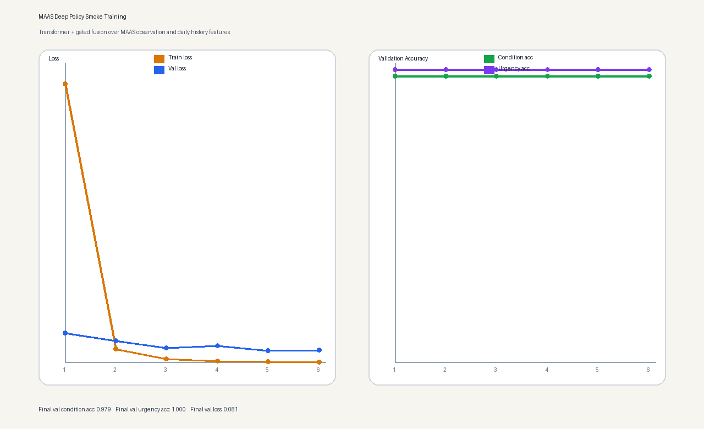

# MAAS: Multi-Step Maternal Triage for OpenEnv Theme 3.1

MAAS is an OpenEnv-compatible maternal-care environment framed as a **professional workflow / world-modeling** task.
An agent must reason over incomplete prenatal data, request missing signals, carry temporal belief state across multiple check-in days, and decide the safest final triage action.

## Quick Links

- **Live OpenEnv API (Docker Space):** [https://huggingface.co/spaces/sparsh122/maas-openenv](https://huggingface.co/spaces/sparsh122/maas-openenv) — FastAPI on port 7860; OpenEnv endpoints `/reset`, `/step`, `/state`; demo UI at `/openenv-demo`.
- **Short writeup (mini-blog):** [`results/mini_writeup.md`](results/mini_writeup.md)
- Hugging Face repo mirror: [https://huggingface.co/sparsh122/MAAS](https://huggingface.co/sparsh122/MAAS)
- Latest HF GRPO artifacts: [https://huggingface.co/sparsh122/maas-grpo-qwen05b-fix2](https://huggingface.co/sparsh122/maas-grpo-qwen05b-fix2)
- OpenEnv manifest: [`openenv.yaml`](openenv.yaml)
- Primary training script: [`train_openenv_ppo.py`](train_openenv_ppo.py)
- Colab-friendly PPO entrypoint: [`train_trl.py`](train_trl.py)
- Optional GRPO / Unsloth path: [`train_grpo.py`](train_grpo.py)
- Multi-turn GRPO path: [`train_grpo_multiturn.py`](train_grpo_multiturn.py)
- PPO notebook: [`niva_training.ipynb`](niva_training.ipynb)
- GRPO notebook: [`niva_grpo_training.ipynb`](niva_grpo_training.ipynb)
- Multi-turn GRPO notebook: [`niva_grpo_multiturn_training.ipynb`](niva_grpo_multiturn_training.ipynb)
- Space deployment files: [`Dockerfile`](Dockerfile), [`requirements-space.txt`](requirements-space.txt), [`.dockerignore`](.dockerignore)
- Submission slides: [OpenEnv Hackathon Deck](https://docs.google.com/presentation/d/1KzV0MxZYYA6PXXJ-nAcSRUn5staJkfQvEgHF1QVl5as/preview?pru=AAABnedodns*3ITAIB6zwg6GBoSPLOY7LQ&slide=id.g3e610e50443_9_233)
- Training curve: [`results/maas_deep_policy_demo/training_curve.png`](results/maas_deep_policy_demo/training_curve.png)
- Training summary: [`results/maas_deep_policy_demo/demo_summary.json`](results/maas_deep_policy_demo/demo_summary.json)
- Submission evidence summary: [`results/submission_evidence.md`](results/submission_evidence.md)
- Baseline report: [`results/baseline_report.md`](results/baseline_report.md)
- Baseline vs trained summary: [`results/baseline_vs_trained.json`](results/baseline_vs_trained.json)

## Current Submission Status

- The environment itself is ready for review: partial observability, multi-step actions, temporal belief state, and deterministic safety-first reward logic are all implemented in-repo.
- The latest post-fix Hugging Face GRPO job (`69ed2261d70108f37acdef0e`, created on April 26, 2026 at 01:51 IST) completed successfully and uploaded checkpoints, completion logs, and `training_summary.json` to [`sparsh122/maas-grpo-qwen05b-fix2`](https://huggingface.co/sparsh122/maas-grpo-qwen05b-fix2).
- The earlier post-fix run [`sparsh122/maas-grpo-qwen05b-fix1`](https://huggingface.co/sparsh122/maas-grpo-qwen05b-fix1) proved the `-20` reward collapse was fixed and logged a non-zero-gradient step.
- The current limitation is that the newest 3-epoch run still has a mean benchmark score of about `0.01`, with most steps returning `grad_norm = 0` and `reward_std = 0`, so the GRPO path is operational but not yet a strong proof of policy improvement.
- The new multi-turn environment and multi-turn GRPO pipeline are now checked into the repo, but the first full multi-turn training run still needs to be executed and recorded as submission evidence.
- Space deployment files are included in this repo, but the public Space should only be linked as the primary demo once the live app sync is finalized.

## Problem

Maternal triage in low-resource settings is often delayed because the right decision depends on:

- incomplete or noisy signals,
- short time windows of recent check-ins,
- latent complications that are not directly observable,
- and urgent escalation decisions where under-escalation is costly.

MAAS turns that into an OpenEnv training problem. The goal is not just classification. The goal is to train an agent to **behave safely under uncertainty**.

## Why This Fits Theme 3.1

This environment is designed around **world modeling / professional tasks**:

- The agent sees only part of the clinically useful information at first.
- It can choose to **request a BP recheck**, **request a kick count**, **advance to the next day**, **refer to PHC**, or **diagnose**.
- Episodes unfold across a **three-day partially observable trajectory** instead of one static snapshot.
- Reward is shaped by medical safety, urgency alignment, temporal evidence, and under-escalation penalties.

That makes MAAS closer to a professional triage workflow than a one-shot health classifier.

## Environment Design

### What the Agent Sees

`reset(trajectory_id=None)` returns:

- a structured `observation`,
- an LLM-readable `text_observation`,
- system and user prompts,
- valid conditions and urgencies.

The observation includes:

- patient profile and pregnancy stage,
- current-day visible vitals and symptom summaries,
- temporal metadata such as `episode_day_index` and `belief_state`,
- `available_signals`, `withheld_signals`, and `signal_mask`.

### What the Agent Can Do

The action schema is:

```json
{
  "action_type": "request_bp_recheck | request_kick_count | advance_day | refer_to_phc | diagnose",
  "target": "optional final diagnosis",
  "urgency": "optional final urgency",
  "rationale": "short explanation"
}
```

Current supported actions:

- `request_bp_recheck`: explicitly confirm the current day's blood pressure at a small information cost
- `request_kick_count`: explicitly confirm the current day's kick count at a small information cost
- `advance_day`: move from day 1 to day 2 or from day 2 to day 3
- `refer_to_phc`: make an intermediate referral decision before a final diagnosis
- `diagnose`: finish the episode with condition + urgency

### Temporal Belief Updates

Episodes are not static. MAAS now carries evidence forward across a three-day prenatal trajectory:

- `reset()` starts at day 1
- `advance_day` reveals the next day’s observation
- risk flags and belief state update as later-day evidence becomes visible

### Partial Observability

MAAS withholds information by day:

- day 1: basic vitals only
- day 2: vitals plus symptom flags
- day 3: full observation including history flags and late-episode context

This forces the agent to reason under uncertainty instead of simple pattern matching.

## Reward Logic

Reward is computed by the environment and returned by `step()` with `reward_components`.

Key pieces:

- small information cost for `request_bp_recheck` and `request_kick_count`
- neutral `advance_day`
- intermediate reward for clinically appropriate `refer_to_phc`
- final reward composed from condition accuracy, urgency alignment, safety, efficiency, and over-escalation penalty

This is designed to teach the agent that **unsafe confidence is expensive**.

## OpenEnv API

MAAS follows the standard Gym-style surface:

```python
env.reset(trajectory_id="traj_preeclampsia_slow")
env.step(action)
env.state()
```

HTTP endpoints:

- `POST /reset`
- `POST /step`
- `GET /state`
- `GET /health`

Example:

```bash
curl -X POST http://127.0.0.1:7860/reset \
  -H "Content-Type: application/json" \
  -d '{"trajectory_id": "traj_preeclampsia_slow"}'

curl -X POST http://127.0.0.1:7860/step \
  -H "Content-Type: application/json" \
  -d '{"action_type":"advance_day","rationale":"Gather the next day of evidence before diagnosing"}'

curl http://127.0.0.1:7860/state
```

## Training

### Primary Training Path

The main rerunnable script is [`train_openenv_ppo.py`](train_openenv_ppo.py).

It trains directly against the current MAAS environment loop:

```text
reset -> prompt observation -> multi-step LLM actions -> env.step -> reward -> PPO update
```

Example:

```bash
python train_openenv_ppo.py \
  --model-name Qwen/Qwen2.5-1.5B-Instruct \
  --user-ids 1,2,3 \
  --epochs 1 \
  --batch-size 1 \
  --mini-batch-size 1 \
  --max-episode-steps 4
```

If your local `trl` build does not expose PPO classes anymore, use the GRPO path below or run the PPO script in a PPO-capable TRL environment on Colab / Hugging Face Jobs.

### Colab-Friendly Entrypoint

[`train_trl.py`](train_trl.py) re-exports the same PPO loop for notebook usage.

### Notebooks

- PPO workflow notebook: [`niva_training.ipynb`](niva_training.ipynb)
- GRPO workflow notebook: [`niva_grpo_training.ipynb`](niva_grpo_training.ipynb)
- Multi-turn GRPO workflow notebook: [`niva_grpo_multiturn_training.ipynb`](niva_grpo_multiturn_training.ipynb)

### Optional GRPO / Unsloth Path

[`train_grpo.py`](train_grpo.py) provides an optional TRL GRPO path with `--use-unsloth` support for hackathon GPU runs and Hugging Face Jobs.

Example:

```bash
python train_grpo.py \
  --model-name Qwen/Qwen2.5-1.5B-Instruct \
  --epochs 1 \
  --num-generations 2 \
  --use-unsloth
```

To persist a Hugging Face Jobs run back to the Hub:

```bash
python train_grpo.py \
  --model-name Qwen/Qwen2-0.5B-Instruct \
  --epochs 1 \
  --num-generations 2 \
  --hub-model-id sparsh122/maas-grpo-qwen05b \
  --push-to-hub
```

### Multi-Turn GRPO Path

[`train_grpo_multiturn.py`](train_grpo_multiturn.py) trains against the new three-day partially observable trajectory environment.

It:

- builds conversation-style teacher rollouts from all 8 hardcoded trajectories
- augments them with low-risk trap examples and day-1 emergency examples
- saves `comparison_reward_curve.png`
- saves `mixed_signals_before_after.txt` for `traj_mixed_signals_hard`

Example:

```bash
python train_grpo_multiturn.py \
  --model-name meta-llama/Llama-3.2-1B-Instruct \
  --epochs 1 \
  --num-generations 2 \
  --use-unsloth
```

## Training Evidence

The repo includes checked-in evidence that MAAS was actually trained and evaluated:

- Training curve image: [`results/maas_deep_policy_demo/training_curve.png`](results/maas_deep_policy_demo/training_curve.png)
- Training history: [`results/maas_deep_policy_demo/training_history.json`](results/maas_deep_policy_demo/training_history.json)
- Demo run summary: [`results/maas_deep_policy_demo/demo_summary.json`](results/maas_deep_policy_demo/demo_summary.json)
- Baseline report: [`results/baseline_report.md`](results/baseline_report.md)
- Baseline vs trained summary: [`results/baseline_vs_trained.json`](results/baseline_vs_trained.json)
- Single-step GRPO summary: [`results/grpo_training_summary.json`](results/grpo_training_summary.json)
- Single-step GRPO plot helper: [`results/plot_grpo_metrics.py`](results/plot_grpo_metrics.py)
- Latest HF GRPO artifacts: [sparsh122/maas-grpo-qwen05b-fix2](https://huggingface.co/sparsh122/maas-grpo-qwen05b-fix2)
- 1.5B run evidence (reward/quality charts + metrics):
  - [`results/final_1p5b_reward_chart.svg`](results/final_1p5b_reward_chart.svg)
  - [`results/final_1p5b_quality_chart.svg`](results/final_1p5b_quality_chart.svg)
  - [`results/final_1p5b_run_metrics.csv`](results/final_1p5b_run_metrics.csv)

Current checked-in demo metrics from `demo_summary.json`:

- validation condition accuracy: `0.9792`
- validation urgency accuracy: `1.0000`
- validation loss: `0.0808`

These demo accuracy numbers come from the checked-in RL policy demo (`rl_risk_model.py` and the artifacts under `results/maas_deep_policy_demo/`), not from LLM GRPO; LLM GRPO training is a separate ongoing experiment (see Hub `training_summary.json` and the status bullets above).

Current checked-in baseline summary from `baseline_report.md`:

- average baseline benchmark score: `0.3367`
- PPO stack connected and emitted reward logs before the small-model GPU run stopped

### Training Curve



Caption: training loss drops over epochs while validation condition/urgency accuracy remains high on the held-out demo split (RL policy demo path, not LLM GRPO).

## Running the Environment Locally

### Install

```bash
git clone https://github.com/sparsh1258/MAAS.git
cd MAAS
pip install -r requirements.txt
```

### Start the API

```bash
uvicorn main:app --host 0.0.0.0 --port 7860
```

Open:

- app: [http://127.0.0.1:7860/](http://127.0.0.1:7860/)
- health: [http://127.0.0.1:7860/health](http://127.0.0.1:7860/health)

## Hugging Face Smoke Test

To quickly compare a baseline model against the trained MAAS checkpoint through
`huggingface_hub.InferenceClient`, use:

```bash
export HF_TOKEN="hf_..."
python hf_diagnosis_smoke_test.py
```

By default this runs the critical preeclampsia danger-case prompt against:

- `meta-llama/Llama-3.2-1B-Instruct`
- `sparsh122/maas-grpo-qwen05b-fix2`

Useful variants:

```bash
python hf_diagnosis_smoke_test.py --model sparsh122/maas-grpo-qwen05b-fix2 --strict
python hf_diagnosis_smoke_test.py --model Qwen/Qwen2-0.5B-Instruct
python hf_diagnosis_smoke_test.py --obs-file custom_case.txt
```

If the Meta Llama baseline returns an access error, request access to the gated
model on Hugging Face or swap in an open baseline with `--model`.

## Repo Structure

```text
MAAS/
|-- environment.py
|-- xai_reward_model.py
|-- openenv.yaml
|-- main.py
|-- inference.py
|-- train_openenv_ppo.py
|-- train_trl.py
|-- train_grpo.py
|-- niva_training.ipynb
|-- results/
|-- routers/
|-- tasks/
```

## Why This Matters

MAAS is meant to show a more realistic RL-for-agents setting:

- incomplete information,
- temporal evidence,
- safety-sensitive reward shaping,
- and professional escalation behavior.

The point is not just to say “the model predicted a label.” The point is to train and evaluate whether it learns when to ask for more information and when to escalate safely.
