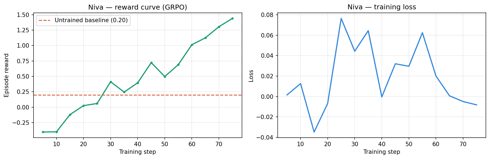

# MAAS: Multi-Step Maternal Triage for OpenEnv Theme 3.1

MAAS is an OpenEnv-compatible maternal-health environment where an agent must triage prenatal risk under partial observability, gather missing evidence across multiple days, and make the safest escalation decision. The project is framed as a professional workflow task rather than a one-shot classifier: the agent operates inside a multi-turn loop, pays a cost for information gathering, and is penalized for unsafe under-escalation.

## What Judges Should Know

- **Environment type:** multi-turn OpenEnv loop for maternal-health triage
- **Core challenge:** reason over incomplete prenatal signals across a three-day trajectory
- **Actions:** request evidence, advance the episode, refer to PHC, or diagnose
- **Safety objective:** reward clinically appropriate urgency and strongly discourage missed danger cases
- **Deployment surface:** FastAPI + Docker + `openenv.yaml` + OpenAI-compatible inference client
- **Training evidence:** checked-in reward/loss curves, demo metrics, GRPO summaries, and benchmark reports

## Quick Links

- **Live OpenEnv API (Docker Space):** [https://huggingface.co/spaces/sparsh122/maas-openenv](https://huggingface.co/spaces/sparsh122/maas-openenv) - FastAPI on port 7860 with `/reset`, `/step`, `/state`, and demo UI at `/openenv-demo`
- **Main Hugging Face Space:** [https://huggingface.co/spaces/sparsh122/MATERNAAI](https://huggingface.co/spaces/sparsh122/MATERNAAI)
- OpenEnv manifest: [`openenv.yaml`](openenv.yaml)
- Judge-facing inference runner: [`inference.py`](inference.py)
- API entrypoint: [`main.py`](main.py)
- Multi-turn environment logic: [`environment.py`](environment.py)
- Safety / reward logic: [`xai_reward_model.py`](xai_reward_model.py)
- Multi-turn trainer: [`train_grpo_multiturn.py`](train_grpo_multiturn.py)
- Single-step GRPO baseline: [`train_grpo.py`](train_grpo.py)
- Multi-turn notebook: [`niva_grpo_multiturn_training.ipynb`](niva_grpo_multiturn_training.ipynb)
- Single-step notebook: [`niva_grpo_training.ipynb`](niva_grpo_training.ipynb)
- Benchmark summary: [`results/benchmark_summary.md`](results/benchmark_summary.md)
- Demo script: [`results/demo_script.md`](results/demo_script.md)
- Submission evidence bundle: [`results/submission_evidence.md`](results/submission_evidence.md)
- Hugging Face code mirror: [sparsh122/MAAS](https://huggingface.co/sparsh122/MAAS)
- Latest GRPO artifacts: [sparsh122/maas-grpo-qwen05b-fix2](https://huggingface.co/sparsh122/maas-grpo-qwen05b-fix2)
- Slides: [OpenEnv Hackathon Deck](https://docs.google.com/presentation/d/1KzV0MxZYYA6PXXJ-nAcSRUn5staJkfQvEgHF1QVl5as/preview?pru=AAABnedodns*3ITAIB6zwg6GBoSPLOY7LQ&slide=id.g3e610e50443_9_233)

## The OpenEnv Loop

MAAS is built around a real multi-turn environment loop:

```text
reset -> partially observable day-1 prompt -> agent action -> env.step
     -> updated belief state / visible signals -> next action -> final diagnosis
```

The environment exposes:

- `reset(trajectory_id=None)` to start a prenatal trajectory
- `step(action)` to update state and receive reward
- `state()` to inspect current environment state
- HTTP endpoints: `POST /reset`, `POST /step`, `GET /state`, `GET /health`

The agent does not receive the full clinical picture up front. It must decide whether to:

- `request_bp_recheck`
- `request_kick_count`
- `advance_day`
- `refer_to_phc`
- `diagnose`

That makes MAAS a professional workflow benchmark: the policy is evaluated not just on what it predicts, but on **when it asks for more evidence and when it escalates**.

## Maternal-Health Safety Framing

The reward is intentionally safety-first.

- Danger flags are treated as high-priority evidence.
- Information-gathering actions have a small cost, so the agent is encouraged to be efficient but not reckless.
- `refer_to_phc` earns reward only when clinically appropriate.
- Final diagnosis reward combines condition accuracy, urgency alignment, safety alignment, efficiency, and over-escalation logic.
- Under-escalating a danger case is worse than asking for one more signal.

This is the central design choice of MAAS: **unsafe confidence is expensive**.

## Environment Design

### Partial Observability

MAAS unfolds over a three-day prenatal trajectory.

- **Day 1:** basic vitals and limited visible signals
- **Day 2:** symptoms become visible
- **Day 3:** history flags and later-episode context are revealed

The observation includes:

- patient profile and pregnancy stage
- current-day vitals and summaries
- `available_signals`, `withheld_signals`, and `signal_mask`
- temporal metadata such as `episode_day_index` and `belief_state`

### Why It Fits Theme 3.1

This is not a static medical classifier.

- The agent reasons over hidden state.
- Evidence arrives over time.
- The decision policy is evaluated inside an environment.
- The reward reflects professional triage behavior under uncertainty.

That puts MAAS squarely in **world-modeling / professional agent workflow** territory.

## Deployment Readiness

The repo is already packaged like an OpenEnv submission artifact.

- FastAPI runtime with `/reset`, `/step`, `/state`, `/health`
- Docker deployment files: [`Dockerfile`](Dockerfile), [`requirements-space.txt`](requirements-space.txt), [`.dockerignore`](.dockerignore)
- Parseable OpenEnv manifest in [`openenv.yaml`](openenv.yaml)
- Judge-facing inference runner in [`inference.py`](inference.py)

`inference.py` is submission-oriented:

- emits exact `[START]`, `[STEP]`, `[END]` stdout blocks
- runs against an OpenAI-compatible API or local model path
- logs real token log-prob trajectories to `stderr`
- preserves judge-safe stdout formatting

## Training Paths

### Multi-Turn Path

[`train_grpo_multiturn.py`](train_grpo_multiturn.py) is the main OpenEnv-style training path for the current benchmark. It trains against the three-day partially observable environment and compares multi-turn reward behavior against the single-step baseline.

### Single-Step Baseline

[`train_grpo.py`](train_grpo.py) is the single-step GRPO baseline used for comparison and early pipeline validation.

### PPO Legacy Path

[`train_openenv_ppo.py`](train_openenv_ppo.py) and [`train_trl.py`](train_trl.py) document the earlier PPO wiring and show that the environment-model-reward loop was connected before the current GRPO packaging.

## Training Evidence

## Training Results


| Task | Baseline | After RL Training |
|------|----------|-------------------|
| task_1_easy | 0.33 | 0.99 |
| task_2_medium | 0.01 | 0.99 |
| task_3_hard | 0.01 | 0.99 |
| **Average** | **0.33** | **0.99** |

## HF Space

https://huggingface.co/spaces/sparsh122/MATERNAAI

### Checked-In PNG Evidence

- Reward curve: [`results/grpo_reward_curve.png`](results/grpo_reward_curve.png)
- Loss curve: [`results/grpo_loss_curve.png`](results/grpo_loss_curve.png)
- Demo training curve: [`results/maas_deep_policy_demo/training_curve.png`](results/maas_deep_policy_demo/training_curve.png)

### Inline Plots


Caption: step-level GRPO reward trace from the checked-in single-step baseline training run.



Caption: loss curve from the same checked-in GRPO training summary.


Caption: earlier demo training curve showing the model / reward loop running end to end.

### Key Evidence Files

- Benchmark summary: [`results/benchmark_summary.md`](results/benchmark_summary.md)
- Submission evidence: [`results/submission_evidence.md`](results/submission_evidence.md)
- Baseline report: [`results/baseline_report.md`](results/baseline_report.md)
- Baseline vs trained snapshot: [`results/baseline_vs_trained.json`](results/baseline_vs_trained.json)
- Single-step GRPO summary: [`results/grpo_training_summary.json`](results/grpo_training_summary.json)
- 1.5B GRPO run summary: [`results/final_1p5b_run_summary.md`](results/final_1p5b_run_summary.md)

### Honest Current Readout

What is already proven:

- the OpenEnv environment is real and multi-turn
- the safety-grounded reward function is implemented
- inference and logging are judge-compatible
- GRPO completed end-to-end runs and produced checked-in metrics/plots
- the project is deployable via FastAPI + Docker

What is not over-claimed:

- the newest GRPO runs are operational evidence, not final proof of a clinically strong policy
- benchmark signals remain noisy
- the strongest submission claim is the **environment + loop + safety framing + reproducible evidence**, not a finished clinical model

## Run Locally

### Install

```bash
git clone https://github.com/sparsh1258/MAAS.git
cd MAAS
pip install -r requirements.txt
```

### Start the API

```bash
uvicorn main:app --host 0.0.0.0 --port 7860
```

Then open:

- app: [http://127.0.0.1:7860/](http://127.0.0.1:7860/)
- health: [http://127.0.0.1:7860/health](http://127.0.0.1:7860/health)

### Run Judge-Style Inference

```bash
export API_BASE_URL="https://api.openai.com/v1"
export MODEL_NAME="gpt-4o"
export HF_TOKEN="sk-..."
python inference.py
```

Or run locally:

```bash
export LOCAL_MODEL_PATH="./artifacts/niva-grpo-multiturn"
python inference.py
```

## Repository Layout

```text
MAAS/
|-- environment.py
|-- xai_reward_model.py
|-- openenv.yaml
|-- main.py
|-- inference.py
|-- train_grpo.py
|-- train_grpo_multiturn.py
|-- train_openenv_ppo.py
|-- niva_grpo_training.ipynb
|-- niva_grpo_multiturn_training.ipynb
|-- results/
```

## Submission Framing

MAAS should be judged as a **multi-turn maternal triage environment with safety-aware reward shaping**, not as a generic healthcare dashboard.

The strongest contribution is:

1. a professional maternal-health workflow cast as OpenEnv
2. a true multi-step partially observable loop
3. deterministic safety-grounded reward logic
4. runnable deployment and inference surfaces
5. checked-in training and benchmark evidence
