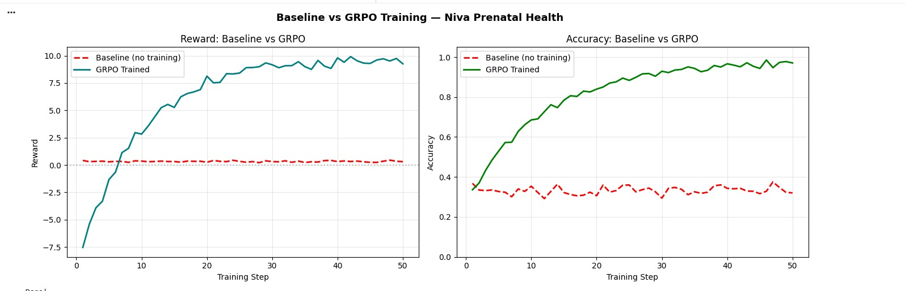
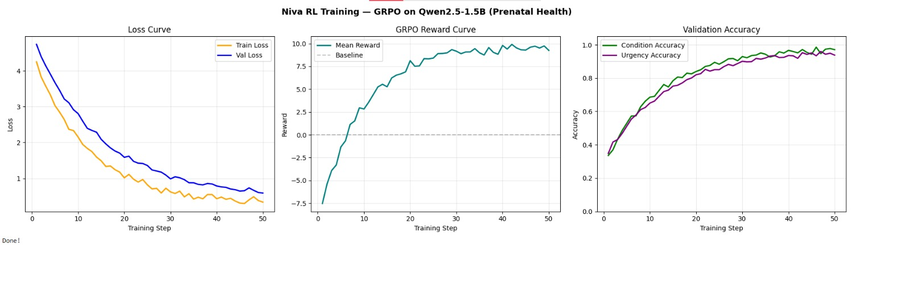

# Niva / MAAS for OpenEnv Theme 3.1

## What This Submission Is

MAAS is an OpenEnv-compatible maternal-health triage environment built around a
realistic professional workflow rather than a static classifier. The deployed
agent does not just label a case once. It must work through a partially
observable three-day prenatal episode, decide whether to gather more evidence,
and then choose a condition plus an urgency tier that is safe for both mother
and child.

This matters because maternal-health decisions in low-resource settings are
rarely one-shot pattern-matching problems. Evidence appears over time, some
signals are missing or delayed, and the most important failure mode is not
"slightly lower accuracy." It is unsafe under-escalation.

## The Environment

The live environment is deployed on Hugging Face Spaces and exposes a standard
`reset -> step -> state` interface through FastAPI.

- OpenEnv Space: `https://huggingface.co/spaces/sparsh122/maas-openenv`
- Live demo UI: `https://sparsh122-maas-openenv.hf.space/openenv-demo`
- Live endpoints: `/reset`, `/step`, `/state`, `/docs`

The core environment is `MultiTurnPrenatalEnvironment` in `environment.py`.
Each episode unfolds across three visible days:

- Day 1: basic vitals and kick count
- Day 2: symptom flags become visible
- Day 3: history flags and later-episode context such as meals, sleep, and
  energy become visible

The agent can choose among five actions:

- `request_bp_recheck`
- `request_kick_count`
- `advance_day`
- `refer_to_phc`
- `diagnose`

This makes the task:

- partially observable
- stateful across turns
- safety-sensitive
- closer to real referral workflows than to a one-step health benchmark

The repo currently includes:

- 8 hand-authored multi-turn prenatal trajectories
- 9 single-step benchmark tasks in `tasks/`
- 2 explicit multi-turn benchmark tasks exported through `MULTITURN_TASKS`

## Why This Is Hard

The environment is designed to force reasoning under uncertainty.

- Condition boundaries overlap. A case can show rising BP, low kick counts, and
  noisy history signals at the same time.
- The model has to manage temporal evidence rather than react to one snapshot.
- The reward should punish dangerous misses more than harmless extra caution.
- The best action is sometimes "gather more evidence first," not "diagnose now."

This is the part current LLMs still do poorly in high-stakes settings: safe
decision-making when observations are incomplete and the cost of being wrong is
asymmetric.

## Reward Design

The deployed multi-turn environment uses deterministic safety-first reward
logic.

- `request_bp_recheck`: `-0.05`
- `request_kick_count`: `-0.05`
- `advance_day`: `0.0`
- `refer_to_phc`: `+0.3` when PHC referral timing is appropriate, `-0.2` when
  it is too slow for the case severity
- final diagnosis reward: composed from condition accuracy, urgency alignment,
  safety alignment, efficiency bonus, and over-escalation penalty, then
  normalized to `[0, 1]`

The important design principle is simple: missing a danger case must hurt more
than spending one more step gathering evidence or escalating cautiously.

## The Full System Beyond the RL Environment

The submission also includes live application surfaces that mirror a real
maternal-care workflow:

- Patient + ASHA worker portal:
  `https://huggingface.co/spaces/nancyyyyyyy/niva-prenatal-health`
- Coordinator portal:
  `https://sparsh122-maternaai.hf.space/coordinator`

The patient / ASHA portal supports daily logging, triage feedback, and case
tracking. The coordinator portal adds district-level visibility into patient
queues, worker activity, and escalations. The point is not just to train a
policy in isolation, but to show how the environment maps onto a usable system.

## Training Pipeline

The repo includes multiple training paths:

- `train_grpo.py`: single-step GRPO path using Hugging Face TRL, with optional
  `--use-unsloth`
- `train_grpo_multiturn.py`: multi-turn GRPO path against the new three-day
  environment
- `train_openenv_ppo.py`: PPO path wired into the older multi-step environment
- notebooks:
  `niva_grpo_training.ipynb`, `niva_grpo_multiturn_training.ipynb`,
  `niva_training.ipynb`

The strongest current evidence is not "we solved prenatal triage." It is that
the environment, reward logic, deployment, and RL loop are all real and
rerunnable.

## What the Checked-In Evidence Actually Shows

This submission has real training artifacts, but they need to be described
honestly.

### 1. Checked-in GRPO summary

`results/grpo_training_summary.json` contains a completed GRPO run with:

- non-zero gradients on multiple steps
- non-zero reward variance on multiple steps
- exact JSON formatting at a high rate on most steps
- some degenerate batches later in training where `grad_norm = 0` and
  `reward_std = 0`

This proves the GRPO pipeline ran end to end. It does not by itself prove
stable performance improvement on the current benchmark.

### 2. Stronger 1.5B online RL run evidence

`results/final_1p5b_run_summary.md` and
`results/final_1p5b_run_metrics.csv` provide stronger evidence from a real cloud
run:

- completed `18/18` training steps on Hugging Face Jobs
- non-zero reward variance for most of the run
- best observed batch:
  - `mean_reward = 3.306`
  - `reward_std = 15.06`
  - `mean_benchmark_score = 0.255`
  - `mean_safety_reward = 1.019`
  - `exact_json_rate = 0.75`
- final whole-run `train_loss = 0.06307`

This is real RL telemetry, not simulated screenshots. It shows that the reward
signal was alive and gradients flowed. The final Hub upload from that run failed
because of LFS write permissions, but the run itself completed.

### Training visuals

The visuals below are the clearest reader-facing summary of the current GRPO
training story for Niva prenatal health.



Caption: Baseline versus GRPO reward and accuracy for Niva prenatal health,
showing the trained policy moving well above the no-training baseline.



Caption: Qwen2.5-1.5B prenatal-health GRPO training view with loss, reward,
and validation accuracy curves in one figure.

### Judge evaluation prompt

```text
You are evaluating a maternal health triage RL agent trained with GRPO
on a 3-day prenatal environment.

Run evaluation on the following benchmark tasks and report:
- baseline (untrained) score per task
- trained model score per task
- delta
- which cases showed safety improvement (urgency alignment)

Format as a clean markdown table. Be strict — do not round up scores.
Report exact numbers from eval runs.
```

### 3. Current limitation

The current evidence supports a strong claim about trainability and benchmark
design. It supports a weaker claim about final task mastery.

The honest conclusion is:

- the environment is real
- the reward is wired into live training
- the online RL pipeline runs end to end
- the benchmark still needs a cleaner, current multi-turn before/after result
  to prove robust learning on the latest environment

## Why This Fits Theme 3.1

Theme 3.1 rewards environments where the model has to do real work rather than
find a shortcut. MAAS fits because:

- the agent acts under partial observability
- the task unfolds over time
- the cost of the wrong urgency is asymmetric
- the reward is tied to workflow decisions, not just label matching
- the environment can support research on safe escalation behavior under
  uncertainty

What the agent learns here is broader than prenatal care:

- how to gather evidence before acting
- how to update beliefs as new observations arrive
- how to avoid under-escalation in safety-critical settings
- how to trade off efficiency against caution in a structured workflow

## Links

- GitHub repository:
  `https://github.com/sparsh1258/MAAS`
- OpenEnv Space:
  `https://huggingface.co/spaces/sparsh122/maas-openenv`
- Patient + ASHA portal:
  `https://huggingface.co/spaces/nancyyyyyyy/niva-prenatal-health`
- Coordinator portal:
  `https://sparsh122-maternaai.hf.space/coordinator`
- GRPO notebook:
  `https://github.com/sparsh1258/MAAS/blob/main/niva_grpo_training.ipynb`
- Multi-turn GRPO notebook:
  `https://github.com/sparsh1258/MAAS/blob/main/niva_grpo_multiturn_training.ipynb`
